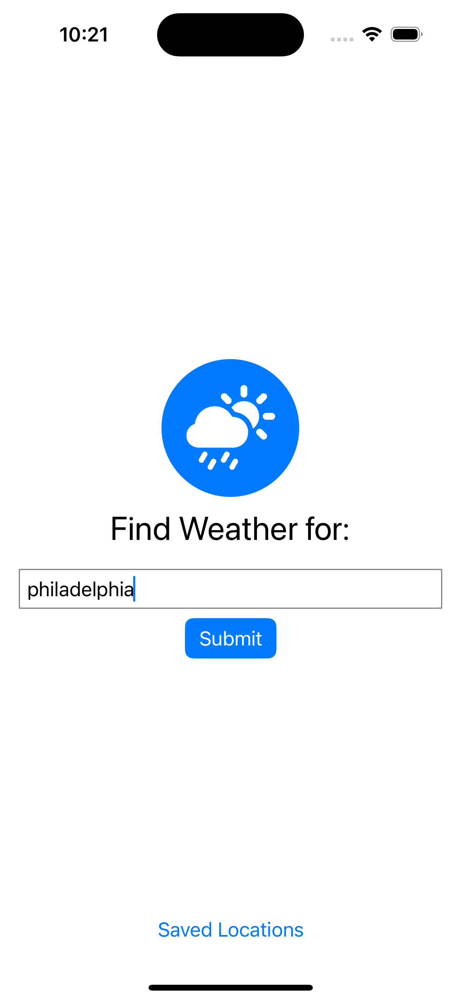
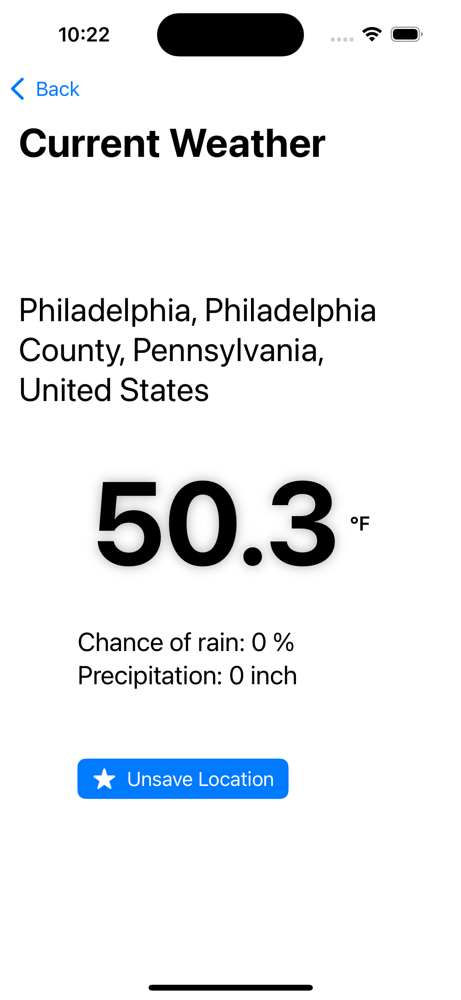
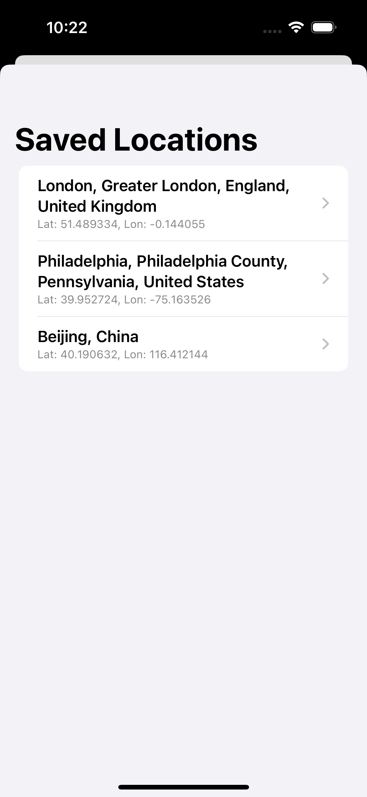

# 🌤️ Weather App

A lightweight SwiftUI weather app that lets users search for any location, view current hourly weather, and save favorite spots for quick access — inspired by the design of Apple’s native Weather app.

## Features

- **Location Search**
  - Enter a city, state, or full address
  - Uses the Nominatim API to geocode locations
- **Hourly Weather Forecast**
  - Temperature (°F)
  - Precipitation probability (%)
  - Precipitation amount (in)
  - Powered by Open-Meteo
- **Favorites**
  - Save and revisit locations
  - Persistent local storage with SwiftData
- Clean MVVM architecture
- Fully async using Swift Concurrency

## Screenshots

  
  
  

## Technologies

- SwiftUI
- SwiftData
- Open-Meteo API
- Nominatim Geocoding API
- Async/Await
- Codable + CodingKeys
